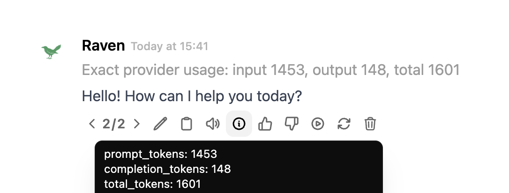

# Context Manager Filter for Open WebUI

Deterministic prompt-context compaction for Open WebUI.

The filter runs before the model call. It preserves system/developer messages
and the most recent turns, trims oversized older messages, compacts stale
history into a retained system summary, and drops raw older messages when the
prompt would exceed a configured budget. Old tool/function messages remain
droppable even if they are near the end of the chat; active trailing tool
results for the current model step are preserved.

Open WebUI also stores exact provider-reported usage after a response completes
(`prompt_tokens`/`completion_tokens`, normalized to `input_tokens`/`output_tokens`
internally). This filter reads that in `outlet` when Open WebUI passes it through
and emits an exact status such as:

```text
Exact provider usage: input 13468, output 487, total 13955
```



The filter still uses an internal token estimate to decide when to compact, but
it does not show that estimate by default because provider token accounting can
differ significantly from local counting. Exact provider usage only exists after
the provider has processed the request.

## How Compaction Works

This filter does a local, deterministic form of compaction:

1. Estimate the prompt size.
2. Preserve system/developer instructions, pinned messages, recent non-tool
   turns, and active trailing tool results.
3. Trim oversized older messages.
4. Remove stale older messages until the prompt is near the configured budget.
5. Insert a compact system summary describing what was removed, with a short
   trace of older message snippets.

That is similar in shape to Codex-style context compaction: raw old transcript
is replaced by a smaller working summary so the next model call can continue.
The current plugin version is intentionally deterministic and does not call a
second model to write a semantic summary. A semantic compactor is possible, but
it needs either a reliable internal model-call API from Open WebUI Functions or
a small Open WebUI core/frontend patch.

This is designed to pair with **Advanced Tool Use**: Advanced Tool Use keeps
tool catalogs and intermediate tool results out of the conversation, while this
filter keeps stale chat history from accumulating until it dominates the prompt.

## Why it matters

Expensive models are only worth using when the prompt stays focused. A long chat
can quietly send thousands of stale tokens on every turn, even after the useful
work has moved on. This filter is a simple guardrail: it spends context on the
current task first.

## Install

1. In Open WebUI: **Admin Panel -> Functions -> + New Function**.
2. Paste the contents of `context_manager_filter.py`.
3. Set the function type to **Filter**.
4. Enable it for the models where you want context pruning.

## Valves

| Valve | Default | Description |
|---|---:|---|
| `priority` | 0 | Filter priority. Lower values run earlier. |
| `enabled` | true | Enable context pruning. |
| `prompt_token_budget` | 24000 | Approximate input-token budget for the model request. |
| `always_keep_recent_messages` | 12 | Newest non-tool chat messages always preserved. |
| `always_keep_system_messages` | true | Preserve system/developer instructions. |
| `max_old_message_chars` | 6000 | Trim older individual messages before dropping history. |
| `prefer_drop_tool_messages` | true | Drop stale tool/function messages before ordinary chat. |
| `pinned_regex` | "" | Optional regex for messages to preserve when possible. |
| `add_pruning_notice` | true | Insert a compact system summary after compaction. |
| `compaction_detail_messages` | 8 | Maximum number of compacted older messages to describe in the retained summary. |
| `compaction_snippet_chars` | 220 | Maximum characters per compacted message snippet. |
| `show_usage_status` | false | Show a rough estimated context usage status before each model call. Off by default because provider accounting can differ. |
| `use_tiktoken_estimate` | true | Use Open WebUI's configured tiktoken encoding for internal compaction estimates when available. |
| `show_exact_usage_status` | true | Show exact provider-reported token usage after each model response when Open WebUI provides it. |
| `debug_events` | false | Show pruning status events in chat. |

## Notes

- Internal pre-call token counts are estimates. They use `tiktoken` when
  available and fall back to a conservative character-based estimate.
- Exact provider token counts are only available after the response and are
  displayed by the `outlet` hook.
- The filter is deterministic. It does not call another model to summarize.
- If the preserved system messages, latest conversational turns, and active
  trailing tool results exceed the budget by themselves, the filter will keep
  them anyway and report the final estimate.
- For best results with Advanced Tool Use, keep `prefer_drop_tool_messages`
  enabled so old verbose tool results are removed before human instructions.
